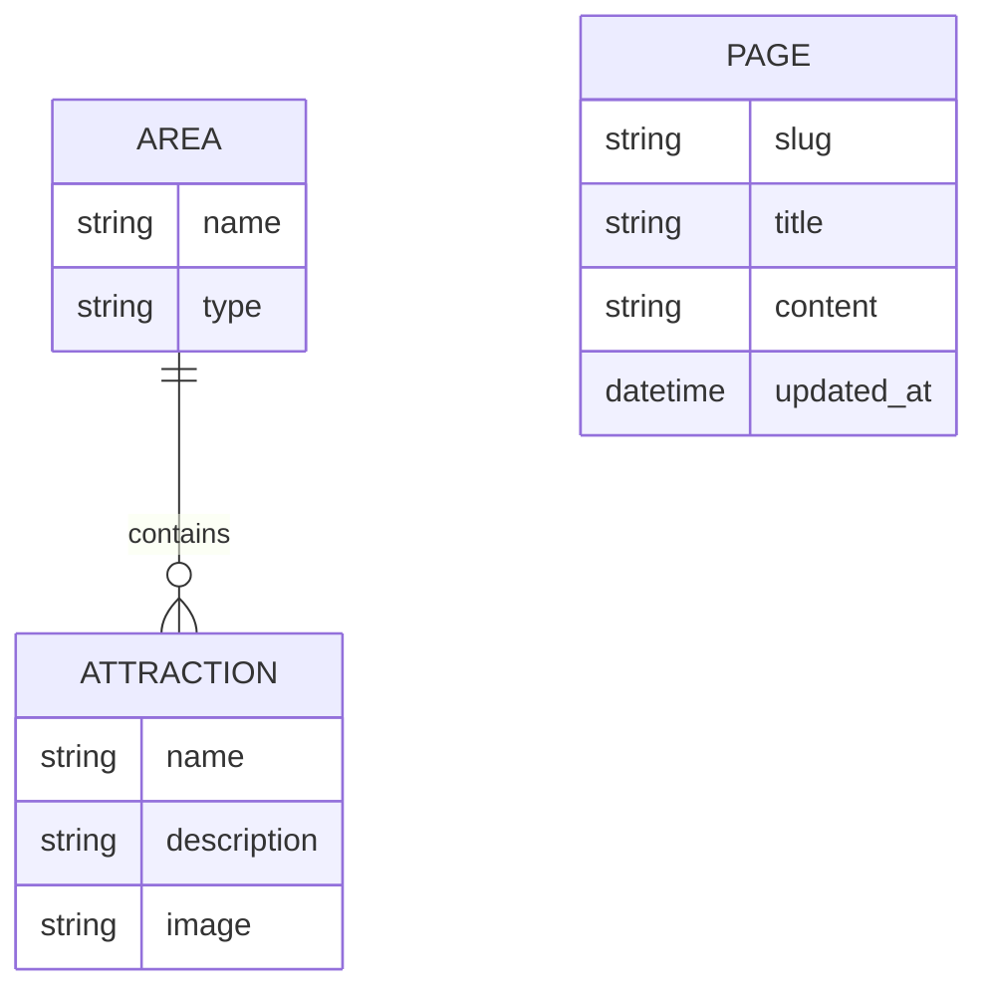

# Romania Explorer

A Django web application for exploring Romanian regions, cities and landmarks through relational data, database-backed content and full CRUD workflows.

The project was developed for **CSC1025 – Developing Internet Applications** at Dublin City University and focuses on practical Django development, relational database modelling, forms, reusable templates and dynamic content management.

---

## Overview

Romania Explorer combines informational country content with a database-driven geography system.

Users can:

- Explore Romanian history, language and reference material
- Browse Romanian areas such as cities, regions and villages
- View attractions associated with each area
- Open detailed attraction pages containing descriptions and images
- Create new areas and attractions
- Update existing records
- Delete records
- Navigate relationships between areas and their attractions

The application demonstrates the transition from static web pages to a structured Django application backed by relational models.

---

## Core Functionality

### Area Management

Romanian locations are represented as database records containing:

- Area name
- Area type
- Associated attractions

The application provides complete CRUD functionality:

- Create areas
- Read area details
- Update areas
- Delete areas

Each area detail page dynamically displays the attractions associated with that location.

### Attraction Management

Attractions are stored as separate database entities and linked to an area.

Each attraction can contain:

- Name
- Associated area
- Description
- Image

The application supports:

- Attraction listings
- Attraction detail views
- Image display
- Record creation
- Record editing
- Record deletion

### Database-Backed Information Pages

Country information including:

- History
- Language
- Flag information
- References

is stored using Django models rather than being hard-coded directly into individual templates.

This allows informational content to be managed through the application's data layer.

---

## Data Model

The application uses relational Django models to represent geographical information.



The key relationship is:

**One Area → Many Attractions**

This allows the application to:

- Retrieve every attraction belonging to a specific area, such as Bucharest
- Display an area's related attractions dynamically
- Navigate from an attraction back to its associated area
- Keep location and attraction data structured through Django relationships

---

## Django Architecture

The project is separated into two main Django applications.

### `geography`

Responsible for:

- Area and attraction models
- Relationships between areas and attractions
- CRUD workflows
- Django forms
- List and detail views
- Image handling
- Geography-specific URL routing

### `pages`

Responsible for:

- General country-information pages
- Database-backed page content
- Shared navigation
- Context processing
- Static assets
- Page-specific URL routing

### `milestone02`

The Django project configuration containing:

- Application settings
- Root URL configuration
- WSGI configuration
- ASGI configuration

---

## Technical Concepts Demonstrated

- Django models and ORM
- Foreign-key relationships
- Relational database design
- Full CRUD workflows
- Django forms and validation
- URL routing and request handling
- Template inheritance and reusable templates
- Context processors
- Static and media file management
- Database migrations
- Reusable Django fixtures
- Environment-based application configuration

---

## Technology Stack

- Python
- Django 6
- SQLite
- HTML
- CSS
- Django Templates
- Pillow
- Git
- GitHub

---

## Demo Data

The public repository does not include the original development `db.sqlite3` database.

Instead, reusable Django fixtures are provided:

```text
geography/fixtures/demo_data.json
pages/fixtures/demo_pages.json
```

These fixtures recreate the sample geography and informational content used by the application.

Attraction images are included under:

```text
media/attractions/
```

This allows the project to preserve its demonstration content while keeping the local development database out of the public repository.

---

## Running the Project Locally

### 1. Clone the repository

```bash
git clone https://github.com/EmirDemirkol/romania-explorer.git
cd romania-explorer
```

### 2. Create a virtual environment

```bash
python3 -m venv venv
```

### 3. Activate the virtual environment

**macOS / Linux:**

```bash
source venv/bin/activate
```

**Windows:**

```powershell
venv\Scripts\activate
```

### 4. Install dependencies

```bash
python -m pip install -r requirements.txt
```

### 5. Create the local database

```bash
python manage.py migrate
```

### 6. Load the demo content

```bash
python manage.py loaddata pages/fixtures/demo_pages.json
python manage.py loaddata geography/fixtures/demo_data.json
```

### 7. Run the development server

```bash
python manage.py runserver
```

Open:

```text
http://127.0.0.1:8000/
```

---

## Configuration

Django configuration can be supplied through environment variables.

Supported variables include:

```text
DJANGO_SECRET_KEY
DJANGO_DEBUG
DJANGO_ALLOWED_HOSTS
```

An example configuration is provided in:

```text
.env.example
```

This keeps environment-specific configuration separate from the application source code.

---

## Project Structure

```text
romania-explorer/
│
├── geography/
│   ├── fixtures/
│   ├── migrations/
│   ├── templates/
│   ├── admin.py
│   ├── apps.py
│   ├── models.py
│   ├── tests.py
│   ├── urls.py
│   └── views.py
│
├── pages/
│   ├── fixtures/
│   ├── migrations/
│   ├── static/
│   ├── templates/
│   ├── admin.py
│   ├── apps.py
│   ├── context_processors.py
│   ├── models.py
│   ├── tests.py
│   ├── urls.py
│   └── views.py
│
├── media/
│   └── attractions/
│
├── milestone02/
│   ├── settings.py
│   ├── urls.py
│   ├── asgi.py
│   └── wsgi.py
│
├── .env.example
├── .gitignore
├── manage.py
├── requirements.txt
└── README.md
```

---

## What I Learned

Developing Romania Explorer strengthened my understanding of how Django applications move beyond static webpages into structured, database-driven systems.

The project gave me practical experience with:

- Designing relationships between application entities
- Implementing complete CRUD workflows
- Querying related records through Django's ORM
- Connecting models, views, URLs and templates
- Working with forms and user-submitted data
- Handling uploaded media
- Building reusable templates
- Using context processors for shared application data
- Managing database migrations
- Recreating application data through fixtures
- Organising functionality across multiple Django applications

These concepts provide a foundation for larger backend, business-system and enterprise applications where structured data, maintainable architecture and reliable data relationships are important.

---

## Academic Context

Developed as part of:

**CSC1025 – Developing Internet Applications**  
**BSc Computing for Business**  
**Dublin City University**

The associated coursework achieved an **85% overall result**.

The interface was intentionally kept lightweight while the project focused primarily on Django functionality, database relationships, CRUD operations and application structure.

---

## Author

**Emir Demirkol**

BSc Computing for Business  
Dublin City University

[LinkedIn](https://www.linkedin.com/in/emir-demirkol-7ba27a35b)  
[GitHub](https://github.com/EmirDemirkol)
